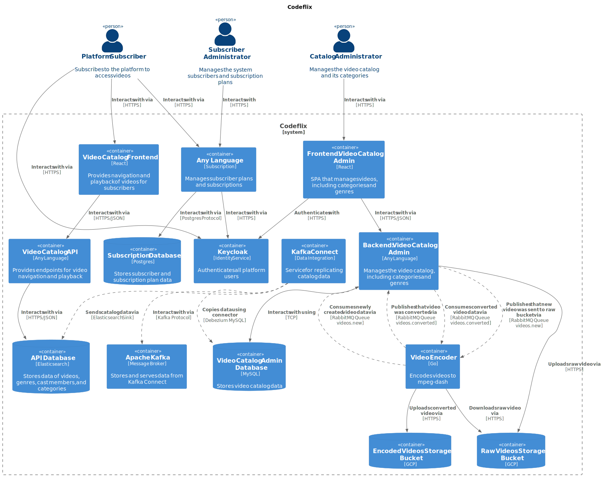

# CodeFlix 

The project described below was developed as the final project for the **Full Cycle 3.0** course. The goal was to design a video streaming platform, named **Codeflix**, that integrates various technologies and services that were learned throughout the course. 

Codeflix is a video streaming platform designed to provide efficient video catalog management, encoding, and user subscription handling. It features a robust video catalog management system, enabling administrators to organize videos into categories and genres via a dedicated frontend and backend platform, supported by a MySQL database. The platform also includes a video encoder that processes raw videos into streaming-friendly formats, stored in scalable cloud storage. Subscribers interact through a video catalog frontend, which provides seamless navigation and playback, powered by an API connected to an Elasticsearch database for efficient data retrieval. For user management, Keycloak handles authentication, ensuring secure access. The subscription module supports plan creation and user subscriptions, integrated with a PostgreSQL database. And finally, messaging and data replication across components, are managed using RabbitMQ for asynchronous events and Kafka Connect for catalog data synchronization, ensuring a cohesive and scalable ecosystem. 

## Services

- [Catalog Admin Backend](./catalog-admin-backend/README.md)

## Recommended Auxiliar Literature

- [Clean Architecture: A Craftsman's Guide to Software Structure and Design](https://www.amazon.com/Clean-Architecture-Craftsmans-Software-Structure/dp/0134494164)
- [Implementing Domain-Driven Design](https://www.amazon.com/Implementing-Domain-Driven-Design-Vaughn-Vernon/dp/0321834577)
- [Domain Drive Design: Tackling Complexity in the Heart of Software](https://www.amazon.com/Domain-Driven-Design-Tackling-Complexity-Software/dp/0321125215)
- [Patterns of Enterprise Application Architecture](https://www.amazon.com/Patterns-Enterprise-Application-Architecture-Martin/dp/0321127420)
- [Test Driven Development: By Example](https://www.amazon.com.br/Test-Driven-Development-Kent-Beck/dp/0321146530)
- [Growing Object-Oriented Software, Guided by Tests](https://www.amazon.com.br/Growing-Object-Oriented-Software-Guided-Tests/dp/0321503627)
