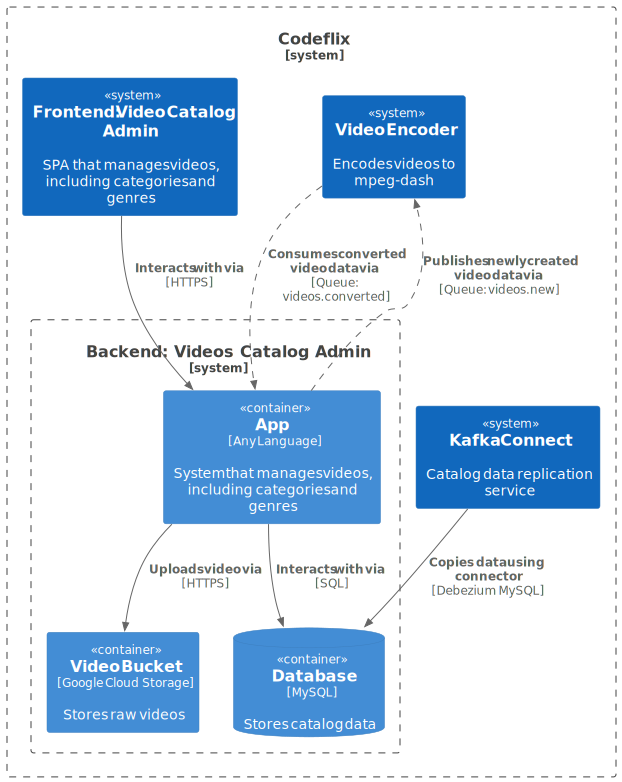

# Catalog Admin Backend

The **Catalog Admin Backend** service is responsible for managing the video catalog, including categories, genres, and videos. It provides an API for the **Catalog Admin Frontend** to interact with, enabling administrators to create, update, and delete categories, genres, and videos.

## Key Features

- **Raw video storage**: The application is reponsible for storing raw uploaded videos data in the cloud using Google Cloud Storage.
- **Video encoding**: The application is responsible for communicating with the **Encoder** service to encode raw videos into streaming-friendly formats.
- **MySQL database**: The application uses a MySQL database to store video catalog data, including categories, genres, and videos.
- **REST API**: The application provides a REST API for the **Catalog Admin Frontend** to interact with, enabling administrators to manage the video catalog.

